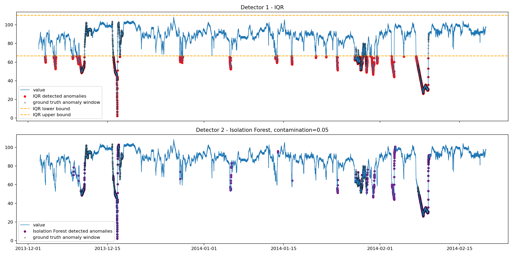
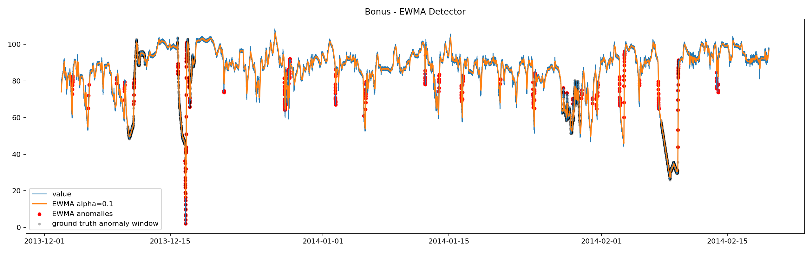

# W1-D1 Assignment: Metric Anomaly Detection

## Dataset

Dataset sử dụng: `realKnownCause/machine_temperature_system_failure.csv` từ Numenta Anomaly Benchmark.

Ground truth label lấy từ anomaly windows trong `labels/combined_windows.json`.

Quy mô dữ liệu:

| Loại điểm | Số lượng |
|---|---:|
| Tổng số điểm | 22,695 |
| Normal | 20,427 |
| Anomaly window | 2,268 |

## Phase 1: EDA Summary

Basic statistics:

| Metric | Value |
|---|---:|
| Mean | 85.93 |
| Std | 13.75 |
| Skewness | -1.83 |
| Min | 2.08 |
| Max | 108.51 |

Dữ liệu không có dạng Gaussian. Histogram cho thấy phần lớn giá trị nằm quanh vùng 80-100, nhưng có đuôi dài kéo về phía giá trị thấp. Skewness = -1.83 xác nhận dữ liệu bị left-skewed mạnh.

Raw ACF giảm rất chậm và duy trì giá trị dương trong hàng trăm lag, cho thấy chuỗi có autocorrelation mạnh và có khả năng chứa non-stationary behavior. Sau khi differencing, ACF giảm gần về 0 và không có peak rõ ràng quanh lag 288 hoặc 576. Vì vậy seasonal pattern không đủ rõ để chọn STL làm detector chính.

Kết luận EDA:

- Data không Gaussian.
- Data bị left-skewed mạnh.
- Raw series có autocorrelation mạnh.
- Không thấy daily seasonal pattern rõ sau differencing.
- Detector statistical phù hợp nhất là IQR vì IQR robust với skewed data và không giả định normal distribution.

## Phase 2: Implement 2 Detectors

### Detector 1: IQR

IQR được chọn vì EDA cho thấy dữ liệu bị skew mạnh và không Gaussian. Rolling Z-score 3σ không phù hợp bằng vì phụ thuộc nhiều vào mean/std.

Tham số:

- `k = 1.5`

Kết quả:

| Metric | Value |
|---|---:|
| Precision | 0.5801 |
| Recall | 0.5877 |
| F1 | 0.5839 |
| False Alarms | 965 |
| TP | 1333 |
| FP | 965 |
| FN | 935 |

### Detector 2: Isolation Forest

Feature table gồm:

- `value`
- `rolling_mean`
- `rolling_std`
- `rolling_min`
- `rolling_max`
- `rate_of_change`
- `lag_1`
- `lag_window`
- `z_score`
- `hour`
- `dayofweek`

Best contamination chọn theo F1:

- `contamination = 0.05`

Kết quả:

| Metric | Value |
|---|---:|
| Precision | 0.7606 |
| Recall | 0.3796 |
| F1 | 0.5065 |
| False Alarms | 271 |
| TP | 861 |
| FP | 271 |
| FN | 1407 |

## Phase 3: So Sánh & Reflection

### Bảng So Sánh 2 Detector

| Metric | Detector 1: IQR | Detector 2: Isolation Forest |
|---|---:|---:|
| Precision | 0.5801 | 0.7606 |
| Recall | 0.5877 | 0.3796 |
| F1 | 0.5839 | 0.5065 |
| False Alarms | 965 | 271 |

### Tuning Log

Isolation Forest contamination tuning:

| Contamination | Precision | Recall | F1 | False Alarms |
|---:|---:|---:|---:|---:|
| 0.01 | 1.0000 | 0.1001 | 0.1820 | 0 |
| 0.02 | 0.9868 | 0.1971 | 0.3286 | 6 |
| 0.05 | 0.7606 | 0.3796 | 0.5065 | 271 |

Nhận xét:

- `contamination = 0.01`: precision rất cao nhưng recall rất thấp, model quá bảo thủ và bỏ lỡ nhiều anomaly.
- `contamination = 0.02`: recall tăng nhẹ, false alarm vẫn thấp.
- `contamination = 0.05`: F1 cao nhất trong 3 lần tune, recall tốt hơn nhưng false alarm tăng.

### Screenshots / Output

Plot kết quả anomaly detection:

Các file output:

- `phase2_anomaly_detection_results.png`: plot original series + anomalies highlighted cho 2 detector.
- `phase2_comparison.csv`: bảng precision, recall, F1, false alarms.
- `if_tuning_log.csv`: log tuning contamination.

### Model Artifact

Isolation Forest model:

- File: `isolation_forest_model.joblib`
- Size: khoảng 665 KB
- Yêu cầu `< 1MB`: đạt.

## Bonus

### Bonus 1: EWMA detector

Em implement thêm EWMA detector với `alpha = 0.1` và threshold `3.0`.

Kết quả so sánh:

| Detector | Precision | Recall | F1 | False Alarms |
|---|---:|---:|---:|---:|
| IQR Detector | 0.5801 | 0.5877 | 0.5839 | 965 |
| EWMA alpha=0.1 | 0.3038 | 0.0529 | 0.0901 | 275 |
| Isolation Forest | 0.7606 | 0.3796 | 0.5065 | 271 |

Plot EWMA:

Nhận xét: EWMA alpha=0.1 hoạt động kém hơn IQR và Isolation Forest trên dataset này. Recall chỉ đạt 0.0529, nghĩa là EWMA bỏ lỡ phần lớn anomaly-window. Nguyên nhân là EWMA làm mượt chuỗi khá mạnh; detector chỉ bắt được một số điểm lệch đột ngột so với đường EWMA, nhưng không bắt tốt các đoạn temperature drop hoặc level shift kéo dài.

### Bonus 2: Log transform + 3-sigma

Em thử chạy 3-sigma trên raw value và sau đó chạy lại 3-sigma trên `log1p(value)`.

| Detector | Precision | Recall | F1 | False Alarms |
|---|---:|---:|---:|---:|
| 3-sigma raw value | 0.9913 | 0.2019 | 0.3355 | 4 |
| 3-sigma log transform | 0.9833 | 0.2081 | 0.3435 | 8 |

Nhận xét: log transform cải thiện recall và F1 rất nhẹ so với raw 3-sigma, nhưng mức cải thiện không lớn. Cả hai phiên bản 3-sigma đều có precision rất cao và false alarms rất thấp, nhưng recall thấp, nghĩa là detector quá conservative và miss nhiều anomaly. Điều này hợp lý vì dataset bị left-skewed, trong khi log transform thường hữu ích hơn với right-skewed data.

Kết luận bonus: IQR vẫn là detector tốt nhất theo F1 trên dataset này. Isolation Forest phù hợp hơn nếu muốn giảm false alarms, còn EWMA alpha=0.1 và 3-sigma không phù hợp làm detector chính cho anomaly-window kéo dài trong dữ liệu này.

## Reflection

Dataset này là machine temperature time series. Dựa trên EDA, dữ liệu bị left-skewed mạnh, không Gaussian và không có seasonal period rõ sau differencing. Vì vậy STL + 3σ không phải lựa chọn chính. Rolling Z-score 3σ cũng không phù hợp nhất vì dữ liệu không gần Gaussian.

IQR là detector statistical phù hợp hơn vì không phụ thuộc vào giả định normal distribution. Trong kết quả hiện tại, IQR có F1 = 0.5839 và recall = 0.5877, tốt hơn Isolation Forest về khả năng bắt anomaly-window. Tuy nhiên IQR có false alarms cao hơn: 965 false alarms.

Isolation Forest có precision cao hơn: 0.7606 và false alarms thấp hơn: 271. Điều này nghĩa là khi Isolation Forest báo anomaly thì đáng tin hơn, nhưng model bỏ lỡ nhiều anomaly hơn vì recall chỉ đạt 0.3796.

Trade-off chính:

- IQR: recall tốt hơn, F1 tốt hơn, nhưng false alarm nhiều hơn.
- Isolation Forest: precision tốt hơn, false alarm ít hơn, nhưng recall thấp hơn.

Production choice:

Nếu mục tiêu là không bỏ lỡ sự cố, Em sẽ chọn IQR hoặc tune Isolation Forest với contamination cao hơn để tăng recall. Nếu mục tiêu là giảm noise cho đội on-call, Em sẽ chọn Isolation Forest vì precision cao và ít false alarms hơn.

Với assignment này, IQR là detector tốt hơn theo F1. Trong production AIOps, Em sẽ dùng IQR làm baseline đơn giản, dễ giải thích, sau đó dùng Isolation Forest như detector bổ sung để giảm false alarm hoặc phát hiện pattern phức tạp hơn khi có nhiều metric.
