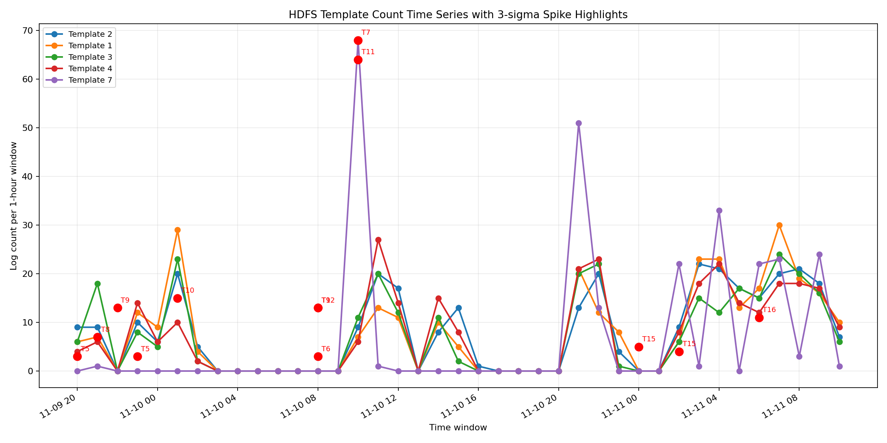

# W1-D2 Submit: Log Mining, Parsing, and Anomaly Detection

## Dataset

Dataset em sử dụng: `HDFS_2k.log` từ Loghub.

- File log: `data/HDFS_2k.log`
- Tổng số dòng log: `2,000`
- Parser: Drain3
- `drain_sim_th` được chọn: `0.5`
- Window dùng cho anomaly detection: `1h`

Em dùng `HDFS_2k.log` trong notebook vì dataset này đủ nhỏ để chạy nhanh. Riêng phần HDFS anomaly label được load từ file label đầy đủ trong `HDFS_v1.zip`.

## Screenshots / Plots

Template count time series với anomaly được highlight:



Các điểm màu đỏ là các cặp template/window được detector 3-sigma đánh dấu là spike bất thường.

## Phase 1: Parse Log Với Drain3

Drain3 đã parse toàn bộ `2,000` dòng log.

Kết quả baseline với `drain_sim_th = 0.5`:

- Parsed lines: `2,000`
- Unique templates: `21`

Top-10 templates:

| template_id | count | template |
|---:|---:|---|
| 2 | 314 | `<*> <*> <*> INFO dfs.FSNamesystem: BLOCK* NameSystem.addStoredBlock: blockMap updated: <*> is added to <*> size <*>` |
| 1 | 311 | `<*> <*> <*> INFO dfs.DataNode$PacketResponder: PacketResponder <*> for block <*> terminating` |
| 3 | 292 | `<*> <*> <*> INFO dfs.DataNode$PacketResponder: Received block <*> of size <*> from <*>` |
| 4 | 292 | `<*> <*> <*> INFO dfs.DataNode$DataXceiver: Receiving block <*> src: <*> dest: <*>` |
| 7 | 263 | `<*> <*> <*> INFO dfs.FSDataset: Deleting block <*> file <*>` |
| 11 | 224 | `<*> <*> <*> INFO dfs.FSNamesystem: BLOCK* NameSystem.delete: <*> is added to invalidSet of <*>` |
| 9 | 80 | `<*> <*> <*> WARN dfs.DataNode$DataXceiver: <*> exception while serving <*> to <*>` |
| 12 | 59 | `081110 <*> <*> INFO dfs.DataNode$DataXceiver: <*> Served block <*> to <*>` |
| 16 | 55 | `081111 <*> <*> INFO dfs.FSNamesystem: BLOCK* NameSystem.allocateBlock: <*> <*>` |
| 10 | 52 | `081110 <*> <*> INFO dfs.FSNamesystem: BLOCK* NameSystem.allocateBlock: <*> <*>` |

Các file đã export:

- `results/top_templates.csv`
- `results/all_templates.csv`

### Tuning Log

| drain_sim_th | num_templates | nhận xét |
|---:|---:|---|
| 0.3 | 17 | Gom nhóm mạnh, số template ít hơn |
| 0.5 | 21 | Cân bằng giữa gom nhóm và giữ chi tiết |
| 0.7 | 820 | Over-splitting, quá nhiều template cho 2,000 dòng |

Em chọn `drain_sim_th = 0.5` vì giá trị này vẫn tách được các event type quan trọng của HDFS, nhưng không làm số template tăng quá mạnh như `0.7`.

## Phase 2: Anomaly Detection Trên Log

Template count time series:

- Số window: `39`
- Số template: `21`
- Window size: `1h`

Detector 3-sigma phát hiện `13` template spike events. Một số spike nổi bật:

| timestamp | template_id | count | z_score | template |
|---|---:|---:|---:|---|
| 2008-11-09 21:00:00 | 8 | 7 | 5.92 | `081109 <*> <*> INFO dfs.DataNode$DataXceiver: <*> Served block <*> to <*>` |
| 2008-11-10 01:00:00 | 10 | 15 | 4.61 | `081110 <*> <*> INFO dfs.FSNamesystem: BLOCK* NameSystem.allocateBlock: <*> <*>` |
| 2008-11-10 10:00:00 | 11 | 64 | 4.52 | `<*> <*> <*> INFO dfs.FSNamesystem: BLOCK* NameSystem.delete: <*> is added to invalidSet of <*>` |
| 2008-11-10 08:00:00 | 12 | 13 | 4.40 | `081110 <*> <*> INFO dfs.DataNode$DataXceiver: <*> Served block <*> to <*>` |
| 2008-11-11 00:00:00 | 15 | 5 | 4.31 | `081111 <*> <*> INFO dfs.DataNode$DataXceiver: <*> Served block <*> to <*>` |

Em tính precision/recall ở window-level vì detector chạy trên template-count time series theo window. HDFS label gốc là block-level, nên em map `BlockId` sang từng log line trước, sau đó đánh dấu một window là anomaly nếu trong window đó có ít nhất một anomaly log line.

| detector | precision | recall | F1 | false alarms |
|---|---:|---:|---:|---:|
| Template Count 3-sigma Window | 0.7000 | 0.3333 | 0.4516 | 3 |
| Isolation Forest Window | 1.0000 | 0.0952 | 0.1739 | 0 |

Detector 3-sigma có F1 tốt hơn vì bắt được nhiều anomaly window hơn. Isolation Forest conservative hơn: không có false alarm, nhưng recall thấp trên sample nhỏ này.

## Phase 3: Embedding Và New Template Detection

Em dùng TF-IDF trên các template cuối cùng do Drain3 sinh ra.

Các file output:

- `results/template_similarity_matrix.csv`
- `results/top_template_similar_pairs.csv`
- `results/template_clusters_tfidf.csv`
- `results/template_cluster_summary.csv`
- `results/injected_new_template_detection.csv`

Các cặp template giống nhau nhất khá hợp lý. Ví dụ, nhiều template `DataNode$DataXceiver Served block` ở các ngày khác nhau có cosine similarity cao.

Agglomerative clustering tạo ra `14` clusters từ `21` templates. Kết quả này hợp lý vì một số template HDFS có nội dung gần nhau, trong khi các template hiếm có count `1` thường đứng riêng.

Dòng log lạ được inject:

```text
081111 112233 999 ERROR dfs.SecurityAuditor: Quantum checksum mismatch for alien_payload_id=ZX-991 source=/unknown-zone action=teleport severity=critical
```

Kết quả Drain3:

- Templates trước khi inject: `21`
- Templates sau khi inject: `22`
- New cluster ID: `22`
- Change type: `cluster_created`
- Detected as new template: `True`

Kết quả này xác nhận Drain3 có thể dùng để phát hiện behavior mới khi một log pattern chưa từng xuất hiện trước đó được ghi ra.

## Phase 4: Mini Log Analyzer

Script:

```text
day-2/log_analyzer.py
```

Lệnh chạy:

```powershell
python day-2/log_analyzer.py day-2/data/HDFS_2k.log
```

Script output ra:

- Tổng số dòng
- Số template unique
- Top-5 templates kèm count và phần trăm
- Template spike trong 1 giờ gần nhất so với trung bình các giờ trước
- New templates xuất hiện lần đầu trong 1 giờ gần nhất

Em test script trên 2 dataset:

| dataset | total lines | unique templates | nhận xét |
|---|---:|---:|---|
| HDFS_2k | 2,000 | 21 | Ít pattern hơn, nhiều event HDFS lặp lại |
| BGL_2k | 2,000 | 151 | Nhiều event kernel/RAS và hardware đa dạng hơn |

BGL có nhiều template hơn HDFS vì BGL là supercomputer log, chứa nhiều loại event khác nhau từ kernel, RAS, hardware component. HDFS lặp lại nhiều thao tác vòng đời block như receiving block, storing block, deleting block và packet responder.

## Reflection

Drain3 parse HDFS khá tốt trong assignment này. Các top template có ý nghĩa và khớp với behavior của HDFS: cập nhật block storage, PacketResponder kết thúc, nhận block, xóa block, và cập nhật invalid block set. Nhờ parse log thành template, hàng nghìn dòng raw log được gom lại thành một số event type dễ phân tích hơn.

Các template cho insight tốt nhất là:

- `NameSystem.delete: <*> is added to invalidSet of <*>`
- `FSDataset: Deleting block <*> file <*>`
- `DataNode$DataXceiver: <*> exception while serving <*> to <*>`

Các template này actionable hơn raw log vì chúng mô tả behavior ở mức pattern. Ví dụ, spike ở template xóa block hoặc invalidSet update có thể gợi ý hoạt động cleanup, replication, hoặc vấn đề liên quan tới data consistency.

Metric anomaly detection và log anomaly detection trả lời hai câu hỏi khác nhau. Metric cho biết có điều gì đó bất thường, ví dụ latency tăng, CPU tăng, error rate tăng. Log giúp hiểu loại event nào đang thay đổi và thường cung cấp manh mối root cause. Trong assignment này, template count cho thấy behavior log nào spike, còn metric detector ở Day 1 chỉ phát hiện bất thường trên chuỗi số. Trong production, metric phù hợp để trigger alert, còn log phù hợp hơn để diagnosis.
