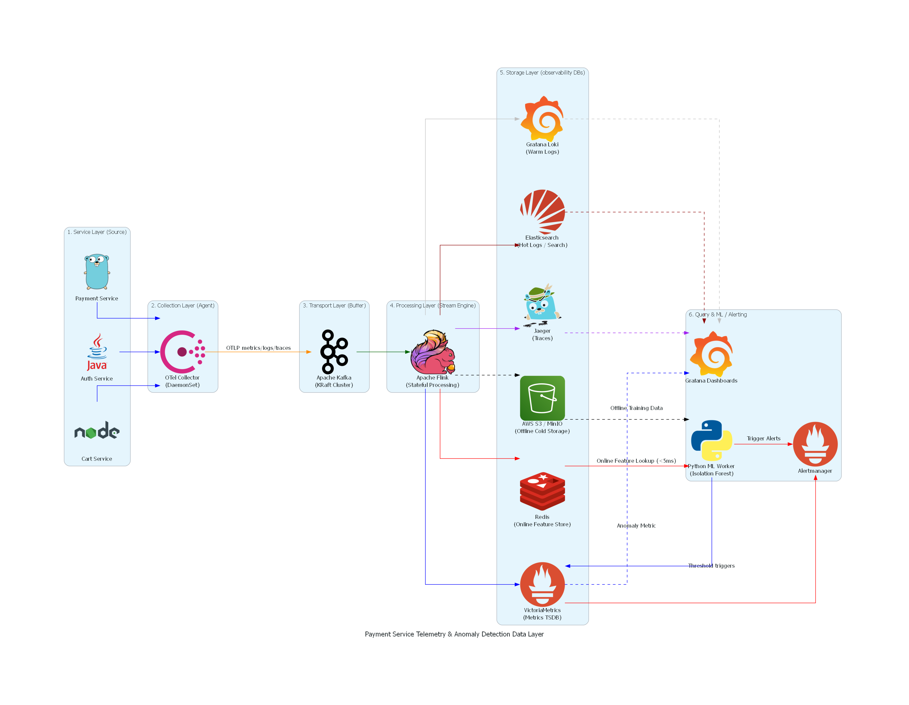
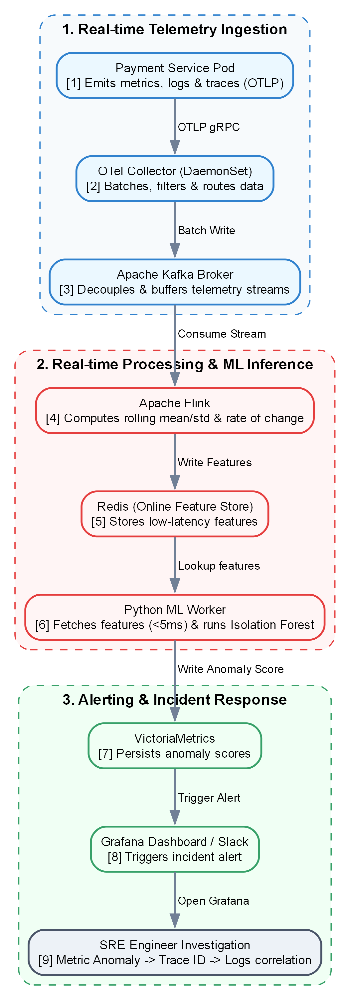

# E2E Data Layer Architecture: Payment Service Anomaly Detection

Tài liệu này thiết kế kiến trúc hệ thống dữ liệu (Data Layer Architecture) hoàn chỉnh phục vụ bài toán **phát hiện bất thường (Anomaly Detection) trên Payment Service**. 

Hệ thống được thiết kế theo luồng xử lý: **Service → Collection → Transport → Processing → Storage → Query/ML** để đảm bảo khả năng chịu tải cao, chi phí tối ưu và độ trễ cực thấp trong môi trường Microservice thực tế.

---

## 1. Sơ đồ Kiến trúc Tổng thể (Architecture Diagram)

Sơ đồ dưới đây mô tả luồng di chuyển của 3 tín hiệu giám sát chính (Metrics, Logs, Traces) và cách dữ liệu được xử lý real-time để phục vụ giám sát và Machine Learning.

---

## 2. Chi tiết Lựa chọn Công cụ và Nhiệm vụ (Component Breakdown)

| Component | Công cụ lựa chọn | Vai trò & Giải pháp cụ thể | Lý do lựa chọn & Trade-off |
| :--- | :--- | :--- | :--- |
| **1. Service** | **OpenTelemetry SDK** | Tích hợp trực tiếp vào code Payment Service để tự động sinh và xuất các tín hiệu:  - *Metrics*: HTTP/gRPC request rate, latency, error rate, DB connection pool. - *Logs*: Trạng thái giao dịch thanh toán (checkout, refund), stack trace lỗi. - *Traces*: Trace ID cho luồng giao dịch đi qua các microservice. | **Chuẩn hóa (Vendor-Neutral)**: OTel SDK giải quyết bài toán phân mảnh thư viện. Code một lần, dễ dàng xuất dữ liệu sang bất kỳ backend nào (Prometheus, Jaeger, Datadog) mà không cần đổi code. |
| **2. Collection**| **OpenTelemetry Collector**| Chạy dưới dạng **DaemonSet** (mỗi node Kubernetes 1 instance) để nhận dữ liệu từ các Pod qua OTLP protocol. Thực hiện batching, filtering (bỏ log health check), và routing dữ liệu. | **Hiệu năng cao & Tiết kiệm tài nguyên**: Viết bằng Go, nhẹ hơn Fluentd (Ruby). Gom cụm xử lý lọc nhiễu ngay tại Edge/Node trước khi đẩy đi xa, giúp giảm tải băng thông mạng. |
| **3. Transport** | **Apache Kafka** | Broker trung gian đệm dữ liệu (Message Buffer). Phân phối telemetry vào 3 Topic riêng biệt: `payment-metrics`, `payment-logs`, `payment-traces`. | **Reliability & Decoupling**: Khi database storage (như Elasticsearch) bị quá tải hoặc downtime, Kafka sẽ lưu trữ dữ liệu tạm thời (persistence), cho phép downstream Flink/Logstash replay lại dữ liệu khi hệ thống hồi phục.  *Trade-off*: Tăng ~5-15ms độ trễ và chi phí vận hành cluster Kafka. |
| **4. Processing**| **Apache Flink** | Đọc dữ liệu từ Kafka. Thực hiện: 1. *Log Parsing*: Biến log text thô thành cấu trúc JSON. 2. *Stream Aggregation*: Tính toán latency p99 theo sliding window 1 phút. 3. *Feature Engineering*: Tính rolling mean, rolling std, rate of change của error rate rồi đẩy vào Online Feature Store (Redis). | **Stateful Stream Processing**: Flink hỗ trợ xử lý luồng dữ liệu cực lớn với cơ chế exactly-once và quản lý trạng thái (state) cực tốt ở scale lớn. Khác với Spark Streaming chạy theo mini-batch, Flink xử lý real-time trên từng event (event-driven). |
| **5. Storage** | **VictoriaMetrics, Elasticsearch, Grafana Loki, Jaeger, Redis, S3** | Hệ thống lưu trữ phân tầng (**Tiered Storage**): - **VM**: Lưu trữ metrics lâu dài, hiệu năng nén dữ liệu cực tốt. - **ES**: Lưu hot logs lỗi giao dịch trong 7 ngày để tìm kiếm nhanh. - **Loki**: Lưu warm logs thường của toàn bộ hệ thống (rẻ hơn ES 10 lần). - **Jaeger**: Lưu traces phục vụ debug microservice. - **Redis**: Đóng vai trò là Online Feature Store phục vụ ML model với độ trễ < 5ms. - **S3**: Lưu trữ lạnh dữ liệu Parquet lịch sử phục vụ train model offline. | **Tối ưu chi phí (Cost Efficiency)**: - Nếu lưu toàn bộ logs ở ES: Cực kỳ đắt đỏ. - Giải pháp phân tầng (Hot/Warm/Cold) giúp giảm 70% chi phí lưu trữ mà vẫn đáp ứng tốt yêu cầu xử lý sự cố. |
| **6. Query / ML** | **Grafana, Alertmanager, Python ML Worker** | - **Grafana**: Dashboard trực quan hóa tổng thể hệ thống thanh toán. - **ML Worker**: Script chạy Isolation Forest tuần kỳ lấy feature từ Redis để phát hiện bất thường đa biến (multivariate anomaly). | **Khả năng mở rộng & Unsupervised ML**: Sử dụng mô hình Isolation Forest cho bài toán phát hiện bất thường kết hợp (Ví dụ: CPU bình thường nhưng số lượng connection pool tăng và Latency tăng). |

---

## 3. Luồng Xử lý Phát hiện Bất thường & Khắc phục Sự cố (Incident Workflow)

Khi có một sự cố xảy ra trên Payment Service (Ví dụ: Stripe API phản hồi chậm, gây nghẽn kết nối và tăng latency trên Payment Service):

---

## 4. Phân tích Các Quyết định Thiết kế (Architectural Trade-offs)

### A. Kafka vs Direct Push (OTel Collector thẳng đến Storage)
- **Quyết định**: Sử dụng **Kafka** làm lớp đệm.
- **Trade-off**:
  - *Ưu điểm*: Đảm bảo tính tin cậy tuyệt đối. Nếu VictoriaMetrics hoặc Elasticsearch quá tải trong đợt flash sale thanh toán, Kafka sẽ đệm lại dữ liệu để các worker consume ở tốc độ an toàn (Backpressure). Đồng thời, ta có thể cắm thêm pipeline Flink để tính toán Machine Learning từ cùng một nguồn dữ liệu mà không ảnh hưởng tới luồng ghi DB.
  - *Nhược điểm*: Phức tạp hóa việc vận hành (cần quản lý ZooKeeper/KRaft), tăng chi phí hạ tầng (~15% tổng hóa đơn cloud) và tăng 5-15ms độ trễ truyền tin.

### B. VictoriaMetrics vs Prometheus
- **Quyết định**: Sử dụng **VictoriaMetrics (VM)**.
- **Trade-off**:
  - *Ưu điểm*: VM tiêu tốn ít hơn ~70% RAM và ~50% Disk IOPS so với Prometheus truyền thống khi xử lý hàng triệu active time-series (high cardinality). VM hoàn toàn tương thích với PromQL và Grafana, giúp giảm chi phí hạ tầng đáng kể khi hệ thống mở rộng quy mô.
  - *Nhược điểm*: Cần quản lý thêm một công cụ bên thứ ba, cấu hình lưu trữ phân tán phức tạp hơn Prometheus chạy single-node.

### C. Tiered Storage cho Log (Elasticsearch vs Grafana Loki)
- **Quyết định**: Lưu **Hot logs** (7 ngày gần nhất) trên Elasticsearch để dev tìm kiếm full-text nhanh khi fix bug. Lưu **Warm logs** (30 ngày tiếp theo) trên Grafana Loki (chỉ index metadata labels) để giảm dung lượng lưu trữ. Lưu **Cold logs** (> 30 ngày) dạng nén Parquet trên S3.
- **Trade-off**:
  - *Ưu điểm*: Tiết kiệm tối đa chi phí. Với banking log ~1TB/ngày, giải pháp này giúp tiết kiệm tới 75% chi phí so với việc lưu trữ toàn bộ dữ liệu 30 ngày trên Elasticsearch.
  - *Nhược điểm*: Khi kỹ sư muốn truy vấn log cũ hơn 7 ngày, cú pháp tìm kiếm trên Loki sẽ bị giới hạn hơn và thời gian truy vấn lạnh trên S3 sẽ chậm hơn so với Elasticsearch.
