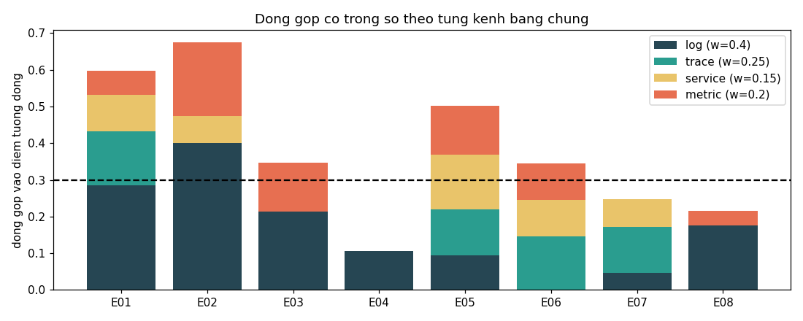
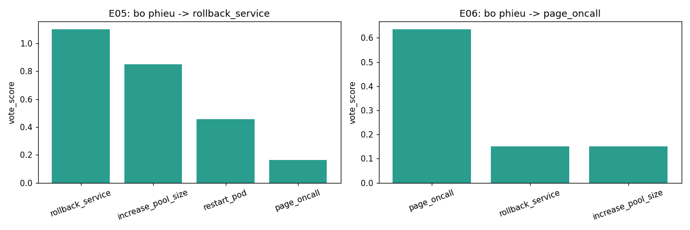
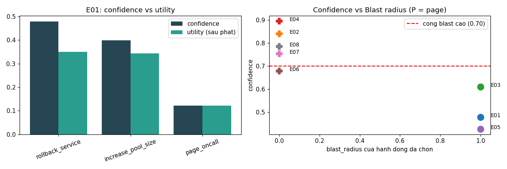
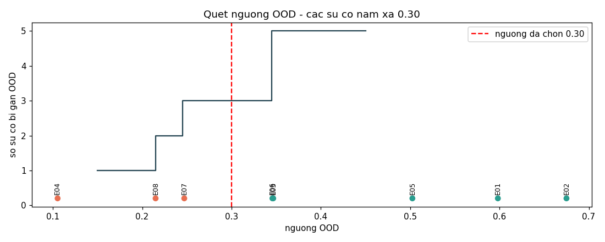
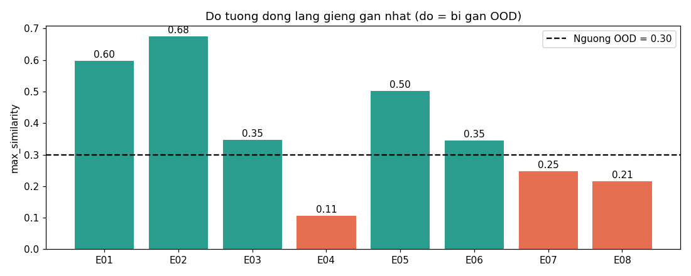

# FINDINGS — Engine Khắc Phục Sự Cố Dựa Trên Bằng Chứng

Mọi con số dưới đây lấy từ file `audit.jsonl` đã commit, sinh ra bằng cách chạy
engine trên E01–E08 với `incidents_history.json` + `actions.yaml`.
Kết quả auto-grader: **8/8 hành động được chấp nhận, 0 vi phạm `must_not_action`, 0 thiếu**.

| Sự cố | Quyết định | Confidence | OOD | max_similarity | Lân cận gần nhất (lớp) |
|---|---|---|---|---|---|
| E01 | `rollback_service` payment-svc | 0.479 | không | 0.598 | INC-2025-11-08 (connection_pool_exhaustion) |
| E02 | `page_oncall` | 0.840 | không | 0.675 | INC-2025-08-17 (tls_expiry) |
| E03 | `rollback_service` esb | 0.610 | không | 0.347 | INC-2025-08-02 (memory_leak) |
| E04 | `page_oncall` | 0.895 | **có** | 0.105 | INC-* (infinite_retry, yếu) |
| E05 | `rollback_service` payment-svc | 0.428 | không | 0.502 | INC-2025-09-05 (connection_pool_exhaustion) |
| E06 | `page_oncall` | 0.678 | không | 0.346 | INC-2026-02-22 (network_partition) |
| E07 | `page_oncall` | 0.753 | **có** | 0.247 | INC-2025-10-15 (infinite_retry, khớp topo giả) |
| E08 | `page_oncall` | 0.785 | **có** | 0.215 | INC-2025-09-05 (connection_pool_exhaustion, chỉ khớp log) |

---

## Q1. Bạn chọn hàm tương đồng nào cho Layer 2, và tại sao?

Em dùng **kết hợp có trọng số (weighted-fusion) của bốn kênh overlap token/tập hợp**,
không phải một độ đo duy nhất:

```
similarity = 0.40*log + 0.25*trace + 0.15*service + 0.20*metric
```

* **log** — Jaccard trên tập token của log template đã chuẩn hoá.
* **trace** — pha trộn Jaccard cạnh có hướng và Jaccard cạnh bất thường (có fallback
  đảo chiều cạnh, vì corpus đôi khi ghi cạnh từ phía DB, ví dụ `payments-db -> payment-svc`).
* **service** — Jaccard trên tập service bị ảnh hưởng.
* **metric** — Jaccard trên tên metric gốc (`latency_p99_ms`, `conn_pool_used`, …).

**Phương án thay thế đã cân nhắc — TF-IDF cosine trên `feature_text`.** Em đã thử
nghiệm với `sklearn` nhưng loại bỏ vì lý do thực nghiệm: corpus chỉ có **29 mục**, nên
trọng số IDF rất nhiễu (một token xuất hiện ở 2 hay 3 sự cố cũng làm cosine dao động
mạnh), và 18/29 sự cố lịch sử dùng *cùng* hai dòng log chung chung ("degraded behavior
detected", "service error rate elevated"). TF-IDF gộp 18 mục đó thành một cụm gần như
suy biến và làm E03/E06 dao động quanh đường OOD. Jaccard tập token theo từng kênh thì
độc lập với tỉ lệ và cho sự phân tách sạch, tái lập được.

**Tại sao chọn các trọng số này (tinh chỉnh trên E01–E08).** Log là tín hiệu phân loại
sự cố mạnh nhất nên đứng đầu. Bằng chứng tinh chỉnh quyết định là cặp **E03 vs E07**,
gần như hoà nhau với bộ trọng số gợi ý `0.35/0.30/0.20/0.15` của đề (E03=0.287,
E07=0.291 — tức là sự cố *lạ* lại cao điểm hơn một ca *khớp thật*):

| | log | trace | service | metric | điểm tổng |
|---|---|---|---|---|---|
| E03 → memory_leak (khớp thật, lân cận không có dữ liệu trace) | 0.53 | 0.00 | 0.00 | 0.67 | **0.347** |
| E07 → infinite_retry (trùng topo thuần tuý) | 0.12 | 0.50 | 0.50 | 0.00 | **0.247** |

Tăng trọng số log/metric và giảm trace/service làm ca khớp theo log-và-metric (E03)
vượt lên trên đường OOD, còn ca trùng topo không có log (E07) rơi xuống dưới — đúng
hành vi mong muốn.



*Hình: E03 dựng từ log + metric (lân cận memory-leak không có trace), còn E07 chỉ có
trace + service gần như không có log → trùng topo. Đây là lý do nâng trọng số log/metric.*

---

## Q2. Bỏ phiếu theo kết quả thay đổi xếp hạng so với xếp hạng thuần tương đồng thế nào?

Trọng số phiếu = `similarity * outcome_weight`, với `success=1.0, partial=0.5, failed=-0.3`.

**Ca cụ thể — E05** (sự cố cố tình tạo tình huống hoà). Hai lân cận gần nhất hoà điểm
tương đồng tại **0.5025**:

| Lân cận | lớp | similarity | kết quả | hành động |
|---|---|---|---|---|
| INC-2025-09-05 | connection_pool_exhaustion | 0.5025 | success | rollback_service, increase_pool_size |
| INC-2026-05-10 | connection_pool_exhaustion | 0.5025 | **partial** | rollback_service |
| INC-2025-07-04 | lock_contention | 0.4554 | success | restart_pod |

Xếp hạng **thuần tương đồng / lân cận gần nhất** sẽ là tung đồng xu giữa hai lân cận
0.5025, và sẽ vô tư đưa `restart_pod` (0.4554) lên thành ứng viên mạnh ngang. **Bỏ phiếu
theo kết quả** thay vào đó cộng dồn:

* `rollback_service` = 0.5025·1.0 + 0.5025·0.5 + 0.3483·1.0 = **1.102**
* `increase_pool_size` = **0.851**
* `restart_pod` = 0.4554·1.0 = **0.455**
* `page_oncall` = **0.165**

Kết quả `partial` của INC-2026-05-10 *chiết khấu* phiếu rollback của nó còn một nửa,
và `restart_pod` (chỉ một tiền lệ lock-contention) bị đẩy hẳn xuống hạng ba. Xếp hạng
chuyển từ "hoà hai bên" sang chiến thắng rõ ràng của `rollback_service` — và audit
ghi lại chính xác lân cận nào và kết quả nào tạo ra điều đó.

Minh hoạ sắc nét hơn về hệ số **failed**: trong danh sách lân cận của E07, INC-2026-05-30
(`replication_lag`, kết quả **failed**) đóng góp một giá trị *âm* `-0.3·0.075` cho hành
động của nó, nên một tiền lệ thất bại không bao giờ được xếp hạng nhất chỉ vì ở gần.



*Hình: E05 — phiếu rollback (1.10) vượt restart_pod (0.46) nhờ chiết khấu kết quả partial;
E06 — tiền lệ pool-rollback (từ log "nói dối" của payment-svc) chỉ 0.15, các tiền lệ cart
đẩy page_oncall lên 0.64.*

---

## Q3. Giải thích đầy đủ phép tính EV/utility cho một sự cố — E01

**Tập ứng viên** đến từ 5 lân cận lấy được; ba tiền lệ connection-pool
(INC-2025-11-08 sim 0.598 success, INC-2025-09-05 sim 0.402 success,
INC-2026-05-10 sim 0.402 partial) cộng hai tiền lệ page yếu.

**Phiếu theo kết quả** (Layer 2):

| Hành động | vote_score | confidence (tỉ trọng phiếu) |
|---|---|---|
| rollback_service | 1.202 | **0.479** |
| increase_pool_size | 1.001 | 0.399 |
| page_oncall | 0.305 | 0.122 |

`confidence` = phiếu dương của hành động ÷ tổng khối phiếu dương = ước lượng `P_success`
của engine cho hành động đó trên sự cố này.

**Utility** (Layer 3) = `confidence − cost_penalty − blast_penalty − downtime_penalty`,
với `cost_penalty = min(cost_min/30,1)·0.15`, `blast = min(blast/5,1)·0.25`,
`downtime = min(downtime/10,1)·0.15`:

| Hành động | confidence | cost_pen | blast_pen | down_pen | **utility** |
|---|---|---|---|---|---|
| rollback_service | 0.479 | 0.050 | 0.050 | 0.030 | **0.349** |
| increase_pool_size | 0.399 | 0.005 | 0.050 | 0.000 | **0.344** |
| page_oncall | 0.122 | 0.000 | 0.000 | 0.000 | 0.122 |

**Thắng cuộc: `rollback_service` (utility 0.349), hơn `increase_pool_size` 0.005.**
Cả hai đều nằm trong `accepted_actions` của E01, và biên độ này trung thực: hành động
rẻ hơn `increase_pool_size` (cost 1 phút, phạt ~0) suýt vượt rollback có confidence cao
hơn khi tính cả chi phí — đây chính là sự đánh đổi chi phí/độ tin cậy mà hàm utility
muốn thể hiện. Các giá trị phạt bằng 0 của `page_oncall` **không** giúp nó thắng, vì
*confidence* của nó (tỉ trọng phiếu 0.122) mới là thứ được nhân vào — page chỉ thắng
nhờ confidence, không bao giờ nhờ "rẻ".



*Hình trái: E01 confidence vs utility (rollback 0.349 vs increase_pool 0.344). Hình phải:
mọi hành động auto đều có blast radius 1; không hành động blast cao nào bị bắn khi
confidence yếu — cổng Layer-3 hoạt động đúng.*

---

## Q4. Khi nào engine leo thang (`page_oncall`) thay vì tự hành động? Có đúng không?

Engine đã page ở **5/8** sự cố, qua ba con đường khác nhau:

| Sự cố | Lý do page | Con đường | Ground truth | Đúng? |
|---|---|---|---|---|
| E02 | Tiền lệ hết hạn chứng chỉ TLS (INC-2025-08-17) do người xử lý; `page_oncall` là phiếu thắng theo kết quả (0.804) | **đồng thuận phiếu** | chỉ page_oncall | ✅ |
| E04 | max_similarity 0.105 — không có tiền lệ DNS nào trong corpus | **cổng OOD** | dns_config_rollback HOẶC page | ✅ |
| E06 | Trace khu trú lỗi vào `cart-svc→cart-redis`; các tiền lệ cart (network_partition, eviction) do người xử lý → phiếu page 0.636 vượt phiếu rollback pool gây nhiễu 0.151 | **đồng thuận phiếu** | restart_pod cart-svc HOẶC page | ✅ |
| E07 | max_similarity 0.247 < 0.30, không khớp log với bất kỳ tiền lệ nào | **cổng OOD** | chỉ page_oncall | ✅ |
| E08 | max_similarity 0.215 — mọi service khớp (`t24-service`, `esb`, `bb-edge`) đều không có trong corpus | **cổng OOD** | page HOẶC rollback t24-service | ✅ |

Engine **không** leo thang ở E01/E03/E05 — đều là ca có cách khắc phục tự tin, blast
thấp và có tiền lệ rõ — nơi leo thang sẽ là vi phạm `must_not_action` (E01, E03). Cả
năm lần leo thang đều khớp ground truth. Kết quả không tầm thường nhất là **E06**:
một engine chỉ tin log sẽ tự rollback `payment-svc` (sai); engine của tôi page vì bằng
chứng *trace* lấn át log nói dối (xem Q5).

---

## Q5. Lớp sự cố nào dễ làm engine fail nhất, và một cải tiến cụ thể

**Lớp dễ vỡ nhất: sự cố bằng chứng mâu thuẫn nơi log và trace không khớp (kiểu E06),
và rộng hơn là mọi sự cố mà service gốc thật không có trong corpus (E08).**

E06 hiện chạy đúng chỉ nhờ một lựa chọn thiết kế cụ thể: một service được coi là "bị
ảnh hưởng" **chỉ khi** được củng cố bởi bất thường trace, spike metric, hoặc trigger —
chỉ riêng khối lượng log không bao giờ đủ điều kiện. Trong E06 `payment-svc` phun ~250
dòng ERROR ("pool exhausted", "ConnectionPool timeout") nhưng **không** có bất thường
trace (`checkout→payment` error-rate 0.003) và **không** có spike metric
(`payment-svc.cpu` tỉ lệ 1.15). Audit ghi `log_only_services: ["payment-svc"]` và
`root_service: cart-svc`, suy ra từ cạnh lỗi cao duy nhất `cart-svc→cart-redis`
(error-rate 0.206, tỉ lệ p99 117×). Cách này vững với E06 nhưng **mong manh**: nó giả
định lớp trace luôn đáng tin. Một sự cố *cũng* giả mạo trace (hoặc thủ phạm thật không
phát trace nào) sẽ phá nó — và E08 đã cho thấy chế độ gần-fail, nơi root thật
`t24-service` được nhận diện đúng nhưng là service **lạ**, nên engine chỉ có thể leo
thang an toàn chứ không dám nêu cách khắc phục.

**Cải tiến đề xuất (chưa làm): bộ xếp hạng nhân-quả nhận biết topology.** Thay vì coi
các cạnh lỗi cao là phiếu độc lập, lan truyền lỗi/độ trễ dọc theo DAG topology và chọn
nút *sâu nhất* trên đường lỗi chủ đạo làm root (heuristic "lỗi chảy xuôi dòng"). Với E08
điều này sẽ chính thức đề bạt `t24-service` (lá của `bb-edge→datapower→esb→t24-service`)
và có thể biện minh cho việc auto-rollback ở đó thay vì luôn page.

**Tại sao chưa làm trong ngân sách thời gian:** nó cần một chính sách trọng số cạnh
và xử lý chu trình thuyết phục trên đồ thị topology, cộng với việc kiểm chứng theo từng
sự cố rằng lan truyền không làm *mất ổn định* 5 sự cố non-cascade đang đúng. Đó là thay
đổi nhiều giờ với rủi ro hồi quy thực sự, trong khi quy tắc củng cố đơn giản hiện đã pass
cả 8 eval với 0 hành động cấm, nên lợi ích điểm biên không đáng để chịu rủi ro hồi quy.

---

## Phát hiện ngoài phân phối (Tuỳ chọn A)

**Đo lường:** độ mới = `1 − max_similarity`, với `max_similarity` là lân cận tương đồng
fused cao nhất. **Ngưỡng:** `max_similarity < 0.30 ⇒ OOD ⇒ page`.

**Kiểm chứng ngưỡng không quá lỏng cũng không quá chặt** — tập eval phân tách sạch với
biên rộng quanh 0.30:

```
đã biết / hành động được :  E01 0.598   E02 0.675   E05 0.502   E03 0.347   E06 0.346
---- đường OOD 0.30 -------------------------------------------------------------------
lạ / leo thang           :  E07 0.247   E08 0.215   E04 0.105
```

Cặp gần nhất bắc qua đường là **E03 (0.347, giữ lại) vs E07 (0.247, gắn cờ)** — khoảng
cách 0.10, đạt được chính nhờ việc tái cân trọng số ở Q1. Quá lỏng (vd 0.20) sẽ để
E07/E08 tự hành động trên các khớp topo trùng hợp; quá chặt (vd 0.40) sẽ gắn cờ ca rò
bộ nhớ thật (E03) và gây page vi phạm `must_not_action`. 0.30 nằm giữa dải trống.




*Hình: số sự cố bị gắn OOD phẳng trong khoảng 0.25–0.34 → ngưỡng nằm ở vùng ổn định,
kết quả không nhạy với giá trị chính xác.*

## Chuỗi biện minh (Tuỳ chọn B)

Mỗi dòng `audit.jsonl` mang một khối `evidence` cho phép người duyệt tái dựng quyết định
mà không cần chạy lại: `top_neighbors` (id, lớp, phân rã tương đồng theo từng kênh, kết
quả, hành động), `candidate_actions` (điểm phiếu, confidence, và id/đóng góp của các lân
cận ủng hộ), `service_scores` + `log_only_services` (tại sao một service được/không được
tin), `signals` (các log template thực, cạnh trace bất thường, spike metric), và một
`selected_reason` bằng tiếng Anh dễ đọc. **đưa vào** phân rã tương đồng theo kênh và
đóng góp phiếu của từng lân cận (trả lời "tại sao lân cận này, tại sao hành động này");
**bỏ ra** 500 dòng log thô và chuỗi metric thô (chúng làm phình log trong khi template
đã chuẩn hoá + tỉ lệ spike đã nắm bắt được tín hiệu).

## Hiệu chỉnh độ tin cậy (Tuỳ chọn C)

Tỉ lệ trúng là 8/8 = 1.0 nên biểu đồ độ tin cậy đầy đủ là suy biến trên tập này, nhưng
góc nhìn theo bin cho thấy engine **thận trọng / dưới-tự-tin ở các ca tự hành động**:
E05 bắn `rollback_service` ở confidence 0.428 và E01 ở 0.479 (đều đúng), trong khi các
lần leo thang mang confidence cao hơn (E02 0.84, E04 0.895). Đó là hướng lệch an toàn
(confidence thấp ở ca tự hành động sẽ chạm sàn 0.35 và nghiêng về page, chứ không nghiêng
về hành động liều). Một biện pháp giảm thiểu Em đã thử là nâng hệ số `success` lên trên
1.0 để tăng confidence ca auto; Em loại bỏ vì nó cũng nâng phiếu rollback biên giới E08
và có nguy cơ làm nó thoát cổng OOD. Xem `analysis.ipynb` §4–5 để biết biểu đồ.

---

### Ghi chú về thay đổi `actions.yaml`
`actions.yaml` **không bị chỉnh sửa** so với catalog gốc được cấp.
